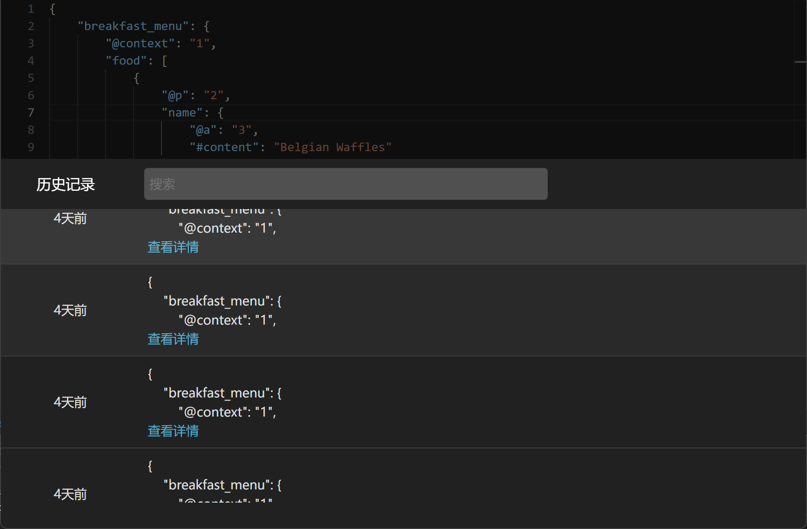
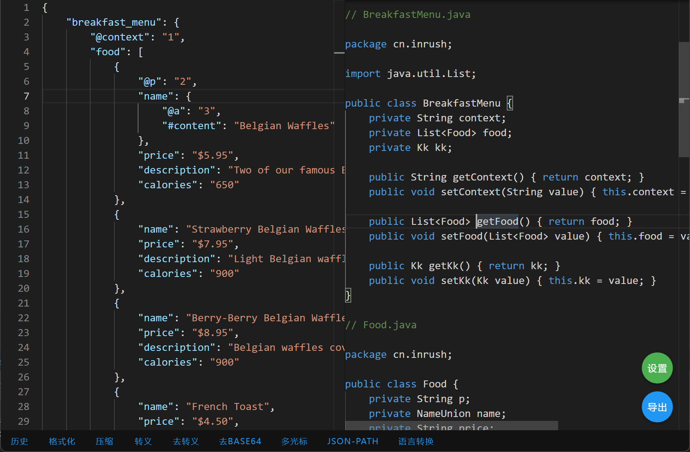
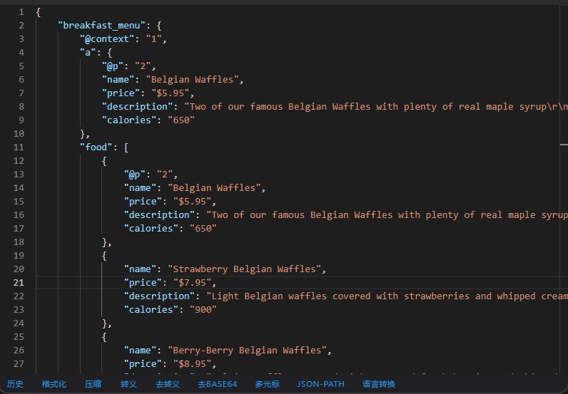
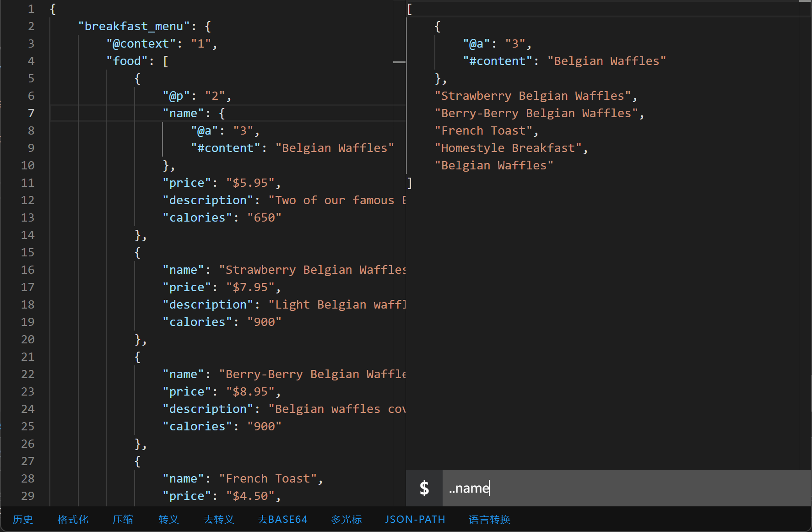
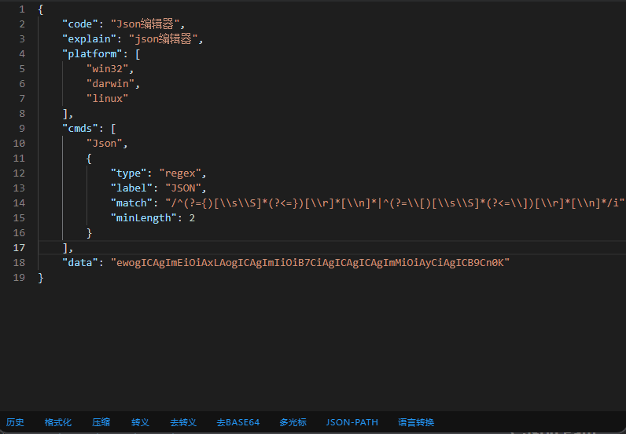
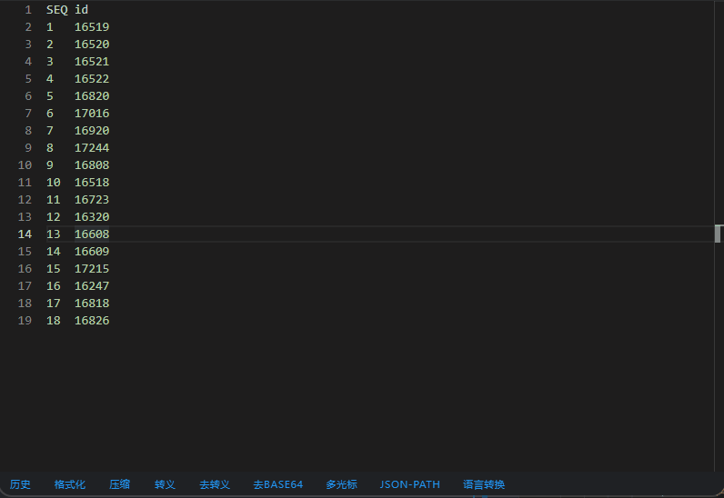

# 多功能Json编辑器

## 功能

1. 历史记录
2. 语言转换
3. Json Path
4. Json压缩
5. Json转义，去转义
6. 去除字段Base64
7. 多光标
8. 粘贴xml自动转JSON

### 1. 历史记录

> 保存最近七天在粘贴到编辑器内的记录,支持搜索

### 2. 语言转换功能

> 可将JSON转换为20中不同的编程语言

#### 支持的语言

| Ruby | JavaScript | Flow | Rust | Kotlin |
|------|------------|------|------|--------|

| Dart | Python | C#  | Go  | C++ |
|------|--------|-----|-----|-----|

| Java | TypeScript | Swift | Objective-C | Elm |
|------|------------|-------|-------------|-----|

| JSON Schema | Pike | Prop-Types | Haskell | Crystal |
|-------------|------|------------|---------|---------|

### 3. Json Path

> 支持JsonPath语法对json进行筛选

### 4. Json压缩

> 支持将JSON压缩到一行

### 5. Json转义，去转义

> 对Json进行转义和去转义

### 6. 去除字段Base64

> 检测Json的所有字段值是否被base64编码过，被编码过的话将自动进行解码

### 7. 多光标

> 可快速对编辑器内的内容插入多个光标，不需要在拖动鼠标进行插入。有两种模式： 
> 第一种：将选中区域所有行的尾部插入光标。 
> 第二种：输入起始行和结束行，在起始行和结束行之间的所有行尾部插入光标。

